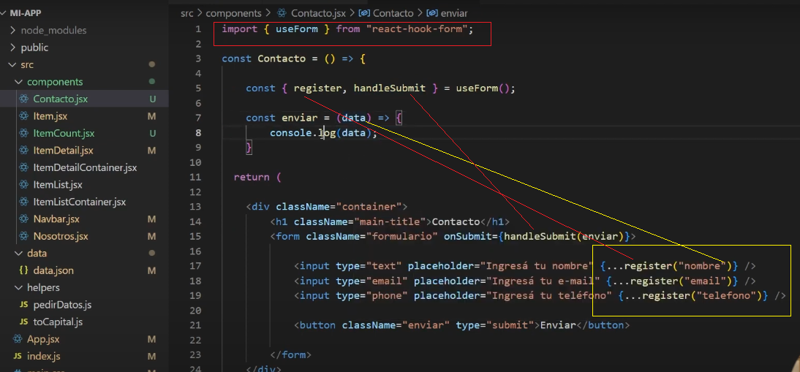

React JS | Clase 01 — Instalación y configuración
https://www.youtube.com/watch?v=2SwKpVVNfIE&list=PL8VCLfCNXjSZfAhqZT7RfWv5Anb8I9PfY

Terminal Visual code revisamos las versiones 
node -v
v18.20.7

npm -v
10.8.2

Creamos la carpeta del proyecto 
react-v1

cmd
cd react-v1
abrimos el visual studio code
C:\react-v1>code .

creamos la aplicacion de React
npx create-react-app .

Revisamos las librerias

Ejecutamos
npm start

Eliminamos estos archivos inecesarios

Limpiamos el archivo indes.js

import React from 'react';
import ReactDOM from 'react-dom/client';

import App from './App';

const root = ReactDOM.createRoot(document.getElementById('root'));
root.render(
  <React.StrictMode>
    <App />
 </React.StrictMode>
);

Limpiamos el archivo App.js

--------------------------------------------------------------------------------------------------------
Clase 03 — Componentes y props

Los componentes de React simpre deben comenzar con mayuscula
Las funciones si pueden comenzar minuscula la sintasix es la misma

Asi se llama un componente recuerde debe comenzar en mayusculas las funciones no
Se pueden usar varias veces un componente

Pasar propiedades

Para ni utilizar la palabra  props

_______________________________________________________________________________________________________
React JS | Clase 04 — useState y useEffect hooks y ciclo de vida de los componentes

importante al revisar el log los eventos se ejecutan dos veces en modeo de desarrollo esto pasa en produccion....se renderizan dos veces por eso comentareamos esto...pero es para prevenir erores
..Recuerde los eventos se ejecutan dos veces ......si no se descomentan
;

 PedirProductos()
      .then((res) => {
        setProductos(res);
        setTitulo(title);
      });

Para controlar esto  manejamos con el hook .....useEffect

  useEffect(() => {
    PedirProductos()
      .then((res) => {
        setProductos(res);
        setTitulo(title);
      });

  }, [title]);
-----------------------------------------------------------------------------
 

//El return se utiliza para desmontar el componente y lo que se quiera ejecutar ya se a una promesa o funcion
  useEffect(() => {
    console.log("componente montado");
    // el retur es para desmontar

    return () => {
        console.log("componente montado");
    }
  }, []);
  ---------------------------------------------------------------------------------
   Se renderiza el componente pero no se monta ni se desmonta el componente si se agrega estado ...text
   
   useEffect(() => {

    console.log("Text modificado");
  }, [text]);
  ---------------------------------------------------------------------------------
     Cuando se modifica se agrega estado text al arreglo se renderiza siempre que se modifica
     

import { useState, useEffect } from "react";

const TextEfect = () => {

    const [text, setText] = useState("");

    function handleText(e) {
        setText(e.target.value);
    }

    useEffect(() => {
        console.log("Componente montado");

        return () => {
            console.log("Componente desmontado");
        }

    }, []);

    useEffect(() => {
        console.log("Componente actualizado");
    }, [text]);

    return (
        

            <input type="text" value={text} onChange={handleText} />
            <h1>{text}</h1>
        

    );
}

//mounting
//updating
//unmounting

export default TextEfect;

------------------------------------------------------------------------------------------------

React JS | Clase 05 — Promesas y .map( ) 

las promesas son funciones resolve, reject

pagina para crear archivos Json()

Si no se pone la funcion que llama la promesa en un useEffect  crea un siclo infinito
para que se ejecute una sola vez useEffect se pone el arreglo vacio    }, [ ]);

Siempre que utilizamos la funcion map  tenemos que poner un key  igularlo con id o algo unico para cada registro  

La logica de React es ir modularizando y seccionando componentes que cada uno tenga su responsabilidad.

-----------------------------------------------------------------------------------------
React JS | Clase 06 — Consumiendo APIs

Pokemon api

https://pokeapi.co/docs/v2#pokemon-section

utilizamos el trabaja con una promesa  
            fetch(url)
            .then((resp) => {
               console.log(resp)
            })

           

el doble .then()  .then() es para que resuelva el estado en pendiente ..puede resultar estatus 
200 si retorna o estatus 404 si no la encuentra el endpoint.

Las respuestas del fetch(url) es asincrona se demora por eso ponemos la condicion 
pokemon > 0 && pokemon.name

ahora apezar que ponemos el id dinamico no funciona ya que por arreglo de dependencias esta vacio solo se ejecuta cuando se monta entonces agregamos el id para que se ejecute cuando se monte y cuando cambie el useEstade del id

   
Instalo ES7 sniper help code : me ayuda a contruir el codigo mas rapido

https://github.com/r5n-labs/vscode-react-javascript-snippets/blob/HEAD/docs/Snippets.md

funciones y promesas
// Promesas o promises son asincronas funciones se declaran con minuscula no en Pascal como los componentes
// las promesas se ejecutan en un bucle por eso toca controlarlas con useEffect() 

------------------------------------------------------------------------------------------
React JS | Clase 07 — Routing y navegación

Instalamos desde la terminal 

npm install react-router-dom

verificammos las dependencias en el archivo package.json

import { BrowserRouter, Route, Routes } from "react-router-dom"; en el archivo App.js

import Navbar from "./components/Menu/Navbar";
import { BrowserRouter, Route, Routes } from "react-router-dom";
import Inicio from "./components/promises/Inicio";
import ItemDetailContainer from "./components/promises/Producto/ItemDetailContainer";
import Pokemon from "./components/promises/Pokemon";
import ItemListContainer from "./components/promises/Producto/ItemListContainer";
import Contacto from "./components/promises/Producto/Contacto";
import { ContextoProvider } from './components/context/ContextApp';
import Carrito from "./components/promises/Producto/Carrito";
import ItemListContainerFb from "./components/promises/Producto/ItemListContainerFb";
import ItemDetailContainerFb from "./components/promises/Producto/ItemDetailContainerFb";
import Checkout from "./components/promises/Producto/Checkout";
import Xxx from "./components/promises/Producto/Xxx";

function App() {

  return (
    

      <ContextoProvider>
        {/* Ctrl + K + U   CTRL + K + C */}
        {/*  <ItemListContainer2 />     */}

        <BrowserRouter>
          <Navbar />
          <Routes>
            <Route path="/" element={<Inicio />} />
            <Route path="/ItemListContainer/:title" element={<ItemListContainer />} />
            <Route path="/ItemListContainerFirebase" element={<ItemListContainerFb />} />
            <Route path="/item/:id" element={<ItemDetailContainer />} />
            <Route path="/Item_Fb/:id" element={<ItemDetailContainerFb />} />
            <Route path="/pokemon" element={<Pokemon />} />
            <Route path="/Contacto" element={<Contacto />} />
            <Route path="/Carrito" element={<Carrito />} />
            <Route path="/Checkout" element={<Checkout />} />
            <Route path="/Xxx" element={<Xxx />} />
          </Routes>
        </BrowserRouter>
      </ContextoProvider>

    

  );
}

export default App;

import React from 'react'
import './Navbar.css'
import { Link } from 'react-router-dom'
import CartWidget from './CartWidget'

function Navbar() {
  return (
    <nav className='navbar' >

     <Link  to='/' className='logo'><h1>React</h1></Link>
        <ul className='lu'>
            <li> <Link to="/">Inicio</Link></li>
            <li><Link to="/pokemon">Pokemon</Link></li>
            <li><Link to="/ItemListContainer/Productos 1">Productos 1</Link></li>
            <li><Link to="/Contacto">Contacto</Link></li>
            <li><Link to="/ItemListContainerFirebase">Productos Firebase</Link></li>
            <li><Link to="/Xxx">Xxx Firebase</Link></li>
            <li><CartWidget/></li>
        </ul>
    </nav>
  )
}

export default Navbar

ç

Usamos parametros dinamicos con  useParams recuerde los parametros son string se cambian a numerico con la funcion Number

import { useParams } from 'react-router-dom';

  const id = useParams().id;

  useEffect(() => {
    pedirProductosPorId(Number(id))

--------------------------------------------------------------------------------------

React JS | Clase 08 — Eventos

Los eventos pueden estar en el nivbiel del padre o en otra libreria enn este caso lo tenemos en el contexto de la aplicacion como antes se manejaban varables globales
en este caso es eventos que se eredan atravez de un componente. Podemos psar estados por referencias y funcines aotravez de las props

Puedes reenviar todas las props con la sintaxis de propagación JSX <Avatar {...props} />, ¡pero no abuses de ella!

-----------------------------------------------------------------------------------------------------------------------------------
React JS | Clase 09 — Formularios 

instalamos en la terminal  para manejar los formularios mas sencillos no como html y javascript

Sin la libreria 

npm install react-hook-form

Con la libreria es mas sencillo menos codigo

Conla libreria console.log(data)

----------------------------------------------------------------------------------------------------------------------------------
React JS | Clase 10 — Context y LocalStorage

El contexto 
const carritoInicial = JSON.parse(localStorage.getItem("carrito")) || [];

inicializa con carrito si hay algo o si no devuelve un arreglo vacio || [];

export const ContextoProvider = ({ children }) => {

const [carrito, setCarrito] = useState([carritoInicial]);

cache o contexto carrito persiste aun si cierras el explordor y abres otro

 

puedo vaciar el carrito  

const vaciarCarrito = () => {
        setCarrito([]);
    }

--------------------------------------------------------------------------------------------------------------------------------------

React JS | Clase 11 — Integrando Firebase

Video de ayuda
 https://www.youtube.com/watch?v=FH0nW3bQ6Kg

 
 
 
 

asi queda  query y where

cambiamos  getDocs(productosRef ) getDocs(q )

Agrgamos un Pedido en la Nueva collecion Pedidos

agragamos el proyecto gitHub
 video de ayuda 

 ------------------------------------------------------------------------------------------------------------------------------------
Deploy React project on Github Pages 

"homepage":  "https://github.com/baterabajo/react"

 agrego esats lineas en package.json
"homepage":  "https://github.com/baterabajo/react",

  "predeploy" : "npm run build",

  "deploy": "gh-pages -d build"
  

----------------------------------------------------------------------------------------------------------------
Como Actualizar mi Repositorio en GitHub
En la terminal

Video de ayuda 
https://www.google.com/search?q=github+visual+code+actualizar&sca_esv=6032389a2ad49ca8&udm=7&biw=1366&bih=617&sxsrf=AHTn8zoCzpeor-z1U2cWKxtwDkiWFFMd_Q%3A1741306442225&ei=SjrKZ6K1DYOTwbkPy8S_2Ag&ved=0ahUKEwiigrz_1_aLAxWDSTABHUviD4sQ4dUDCBA&uact=5&oq=github+visual+code+actualizar&gs_lp=EhZnd3Mtd2l6LW1vZGVsZXNzLXZpZGVvIh1naXRodWIgdmlzdWFsIGNvZGUgYWN0dWFsaXphcjIFECEYoAEyBRAhGKABMgUQIRifBTIFECEYnwUyBRAhGJ8FSJcwUMMHWJQtcAJ4AJABAJgBoAKgAawTqgEFMC44LjS4AQPIAQD4AQGYAg6gAswUwgIGEAAYCBgewgIIEAAYogQYiQXCAgUQABjvBcICBhAAGBYYHsICCBAAGBYYChgewgIIEAAYgAQYogTCAgQQIRgVwgIHECEYoAEYCpgDAIgGAZIHBzIuNC43LjGgB9FD&sclient=gws-wiz-modeless-video#fpstate=ive&ip=1&vld=cid:ac916ed9,vid:_69hncq_Azo,st:0

Agrego los archivos nuevos ya sean imagenes del archivo README.md donde hago el manual
 git add .
 git commit -m "Nuevos cambios en mi app de React"

con esto lo subimos al repositorio en la rama inicial
git push origin main

npm run deploy 

